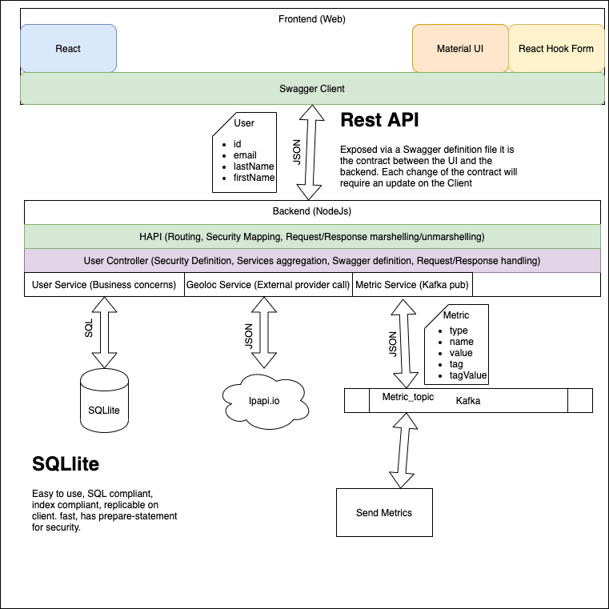

# User management

## Pre-requists

- Java 1.8.0
- Docker
- [install docker-compose ](https://docs.docker.com/compose/install/)

## Presentation

### Subject

This project aims at manage user defined by their names and emails. It allows only people from France to add users, no other restriction. Metrics are pushed to a database for each event happening on the application

### Global overview of the architecture



Database is SQLite for the following reasons

- The way we search in it, is efficient.
- It can be replicated in the UI
- It support indexes and unicity

As we are using an ORM changing to a different database is as easy as changing a string in a config file.

Kafka is used here as asynchronous job queuing, it is used to push metrics which are not mission critical / SLA focused and can also be used to send email for instance.

## install

You need first to load the content of the frontend, backend and metrics (sub)modules.

```
git submodule init
```

Setup for the front and back (database, swagger code generation)

```
./scripts/setup.sh
```

## Build

You need then to build the images to be run, this is a one time job unless you change the dockerfile of the modules

```
docker-compose build
```

Running the entire application

```
docker-compose up
```

## Play

- UI --> http://localhost:3000
- Metrics --> http://localhost:6000

## Backend Code explanation

### UserController.ts

This class handles the request from the client, based on tsoa/hapi framework it is simple as calling the services it needs to achieve the goal it was design for.
It catches the error happening at services level and send back to client a nice error.

The constructor is using Dependency Injection to get the services

```javascript
constructor(
    @inject(TYPES.UserService) private userService: IUserService,
    @inject(TYPES.GeoIpService) private geolocService: IGeoIpService
  ) {
    super(logger);
  }
```

The method are decorated with TSOA annotation to indicate the request form the method accept, this will drive the generation of the swagger.

```javascript
@Post()
  @Example<AddUserResponse>({
    status: 0,
    message: "",
    data: {
      id: 1,
      lastName: "john",
      firstName: "Doe",
      email: "jdoe@yahoo.fr",
    },
  })
  public async addUser(
    @Body() addUserRequest: AddUserRequest,
    @Request() request: any
  ): Promise<AddUserResponse> {
```

Controller are always returning a IServiceStatus so the client knows what happen with the status and we can extends the answer to client with more content without touching the base model.

```javascript
let status: IServiceStatus = { status: 0, message: "" };
let user: User;
try {
  const country = await this.geolocService.getCountry(
    request.info.remoteAddress
  );
  logger.debug("Connection from:" + JSON.stringify(country));
  // reserved is for localhost bypass
  if (country.country === "FR" || country.reserved) {
    user = await this.userService.addUser(addUserRequest);
  } else {
    status = {
      status: ERROR_CODES.NOT_FROM_FRANCE,
      message: "You must be in France to add users",
    };
  }
} catch (e) {
  logger.error("Failed to add a user", e);
  status = this.generateServiceFailureStatus(e);
}
logger.info("End addUser");
return { ...status, data: user };
```

### UserService.ts

Services are handling the complex part, business logic and call to external API, internal other service and external services (Kafka, MQ).

It is designed as a singleton inside the application and referenced in the Dependency Injection library (inversify). Same mechanism applies here regarding the injection of dependencies in the constructor.

```javascript
@provideSingleton(TYPES.UserService)
export class UserService implements IUserService {
  constructor(@inject(CORE_TYPES.SQLService) private sqlService: ISQLService) {}
```

It relies on either DAO or database abstraction (here TypeORM via SQLService)

```javascript
async listUser(search?: string): Promise<User[]> {
    logger.info("Start listUser");
    let list: User[];
    if (isUndefined(search)) {
        list = await this.sqlService.getEntities(UserEntity);
    } else {
        if (RegExp(REGEXP.EMAIL).test(search)) {
        list = await this.sqlService.getEntities(UserEntity, [
            { field: EMAIL_COL_NAME, value: search },
        ]);
        } else {
        list = await this.sqlService.getEntities(UserEntity, [
            { field: LAST_NAME_COL_NAME, value: search },
            { field: FIRST_NAME_COL_NAME, value: search },
        ]);
        }
    }
    logger.info("End listUser");
    return list;
}
```

### GeoIpService.ts

This class calls an external API to get the IP of the caller, it use the configuration injected by environement (developement, production...) to switch parameters

Here the service is decorating the call with a Promise so we have a better integration in the application, using async and await everywhere.
Note the reject will be caught in the try of the controller.

```javascript
return new Promise((resolve, reject) => {
  ipapi.location(
    (res) => {
      if (!res.error) {
        resolve(res);
      } else {
        logger.error(`Failed to get country for the ip:${ip},${res.detail}`);
        reject(null);
      }
      logger.info("End getCountry");
    },
    ip,
    this.configService.getConfig().geoloc.apikey
  );
});
```

## Frontend Code explanation

### Reducer

The application state is based on a redux store, the 2 importants file here are the UserReducer and the Store. For evolution purpose the UserReducer is aggregated with potential other Reducer in Reducers.js

In the UserReducer we find the possible action on the State, but the most interesting part is in the store.js

Because some (all) of our state are calls to the server we need to handle async in a store which is by definition sync
So, we create a middleware a la express that will handle the promise case and dispatch only once the promise is done

```javascript
const asyncMiddleware = (store) => (next) => (action) => {
  if (isPromise(action.payload)) {
    action.payload.then(
      (data) => {
        console.log("Async calls data", data);
        action.payload = data;
        store.dispatch(action);
      },
      (err) => {
        store.dispatch({ type: REQUEST_ISSUE, error: err });
      }
    );
    return;
  }
  next(action);
};
```

Store creation will be the aggregated stores and the middleware

```javascript
const store = createStore(
  reducer,
  initialState,
  applyMiddleware(asyncMiddleware)
);
```

### MainView

The concept of View is a set of component that will be displayed in a single screen or in changing place holder (the part not moving will be called Layout)
The most interesting part of this guy is the connectivity with the reducer

First way of connecting is from state to props, here we are storing the Users reducer state to the current props of the view

```javascript
const mapStateToProps = (state) => ({
  ...state.Users,
});
```

The second way will be from props to state, here we expose methods that will trigger changes inside the state and then the props if needed back to first method

```javascript
const mapDispatchToProps = (dispatch) => ({
  onUserAdd: (payload) =>
    dispatch({ type: ADD_USER, payload: UserService.addUser(payload) }),
  onLoad: (payload) => dispatch({ type: LOAD_USERS, payload }),
  onUserSearch: (payload) =>
    dispatch({ type: FILTER_USERS, payload: UserService.searchUser(payload) }),
});
```

The way to connect all the pieces together

```javascript
export default connect(mapStateToProps, mapDispatchToProps)(MainView);
```

### UserServices

This service calls the backend and hold the business logic if needed, in our case only doing calls.
It relies on a Swagger code generation that create an API file in the source code in TypeScript (this need to be transpiled **npm run tsc**)

For instance this method allow to search for users but if the searchTerms is not filled it will call the listUser.
This is also the place we catch possible issue in the calls and then send them to the view to be dispatched to an error boudarie.

```javascript
searchUser(searchTerms) {
    if (searchTerms != "") {
      return new DefaultApi(null, BASE_URL)
        .searchUser(searchTerms)
        .then(this.handleReponse)
        .catch(this.handleError);
    } else {
      return this.listUser();
    }
  },
```

### ErrorBoundary

This special component is able to catch the exception and display a message to the user, it surround the entire view and can have a special display per view it surround.

## Improvment

- Use a build of the frontend rather than dev server
- Run UI behind a http server

## Debug

Following only a service

```
docker-compose up | grep frontend_1
```
